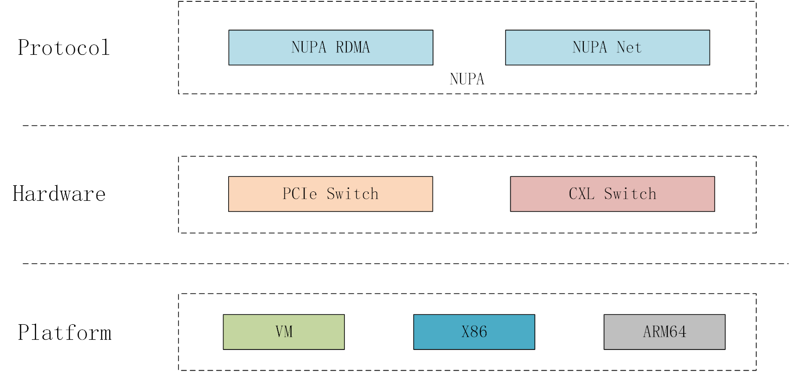
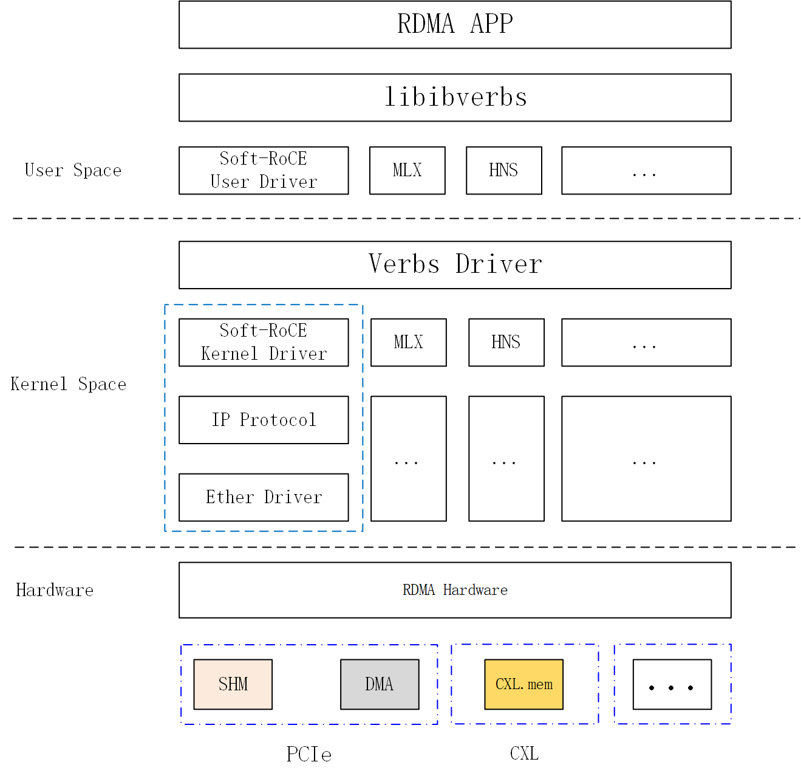
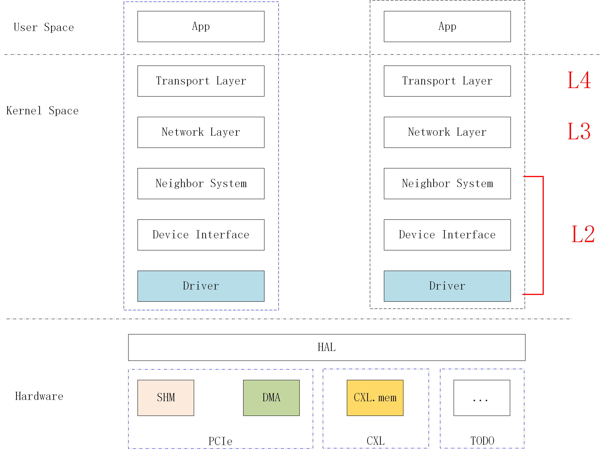

---
# try also 'default' to start simple
theme: seriph
# random image from a curated Unsplash collection by Anthony
# like them? see https://unsplash.com/collections/94734566/slidev
background: https://cover.sli.dev
# apply any unocss classes to the current slide
class: 'text-center'
# https://sli.dev/custom/highlighters.html
highlighter: shiki
# some information about the slides, markdown enabled
info: |
  ## Slidev Starter Template
  Presentation slides for developers.

  Learn more at [Sli.dev](https://sli.dev)
transition: slide-left
title: Welcome to Clussys
mdc: true
---

# NUPA Protocol Intro

Thomas Young

2024/04/08

  
    Go <carbon:arrow-right class="inline"/>
  

  <button @click="$slidev.nav.openInEditor()" title="Open in Editor" class="text-xl slidev-icon-btn opacity-50 !border-none !hover:text-white">
    <carbon:edit />
  </button>
  <a href="https://github.com/slidevjs/slidev" target="_blank" alt="GitHub" title="Open in GitHub"
    class="text-xl slidev-icon-btn opacity-50 !border-none !hover:text-white">
    <carbon-logo-github />
  </a>

<!--
The last comment block of each slide will be treated as slide notes. It will be visible and editable in Presenter Mode along with the slide. [Read more in the docs](https://sli.dev/guide/syntax.html#notes)
-->

---
transition: fade-out
---

# What is NUPA?

The **N**etwoking **U**nified **P**rotocol **A**rchitecture (NUPA) is an open-source software-defined protocol stack designed for the inter connection of servers. Currently, **NUPA** supports traditional ethernet protocol(TCP/IP), AKA, **NUPA-NET**, and RoCE V2 protocol, AKA, **NUPA-RDMA**, and will add support for MPI, AKA, **NUPA-MPI**.

 
 

- 📝 **NUPA-RDMA** - focus on **AI** field, providing RDMA interface based on RoCE V2

- 📝 **NUPA-Net** - focus on **traditional** server connection, providing Ethernet interface

- 📝 **NUPA-MPI** - focus on **HPC** filed. (TODO)

 
 

Read more about [NUPA](https://github.com/Clussys/nupa)

<!--
You can have `style` tag in markdown to override the style for the current page.
Learn more: https://sli.dev/guide/syntax#embedded-styles
-->

<!--
Here is another comment.
-->

---
layout: default
---

# Table of contents

<Toc maxDepth="1"></Toc>

---
transition: slide-up
level: 2
---

# NUPA

Description:
- 🛠 **Support Two major protocols**
- 🛠 **Support Two major hardware platfrom**
- 🛠 **Support different architectures** 

 

Check out [NUPA-Arch](https://github.com/Clussys/nupa) for more.

---
class: px-20
---

# NUPA-RDMA

Description:
- 📤 **Compatible** - 100% compatible with **Verbs API**
- 📤 **Multi-Platform** - Support **PCIe Swicth** and **CXL Switch**
- 📤 **Multi-Arch** - Support **VM/X86/ARM64** Archs, **RSICV** comes later

Check out [NUPA-RDMA](https://github.com/Clussys/nupa) for more.

---
class: px-20
---

# NUPA-Net

Descrition:
- 📤 **Compatible** - 100% compatible with **Socket API**
- 📤 **Multi-Platform** - Support **PCIe Swicth** and **CXL Switch**
- 📤 **Multi-Arch** - Support **VM/X86/ARM64** Archs, **RSICV** comes later

Check out [NUPA-Net](https://github.com/Clussys/nupa) for more.

---
class: px-20
---

# Thanks for watching

More about [NUPA](https://github.com/Clussys/nupa)
###  [Documentations](https://github.com/Clussys/nupa) 
###  [GitHub](https://github.com/Clussys/nupa) 
###  [Showcases](https://github.com/Clussys/nupa/vms)

 
 
 

More about [Clussys](https://clussys.github.io/)

